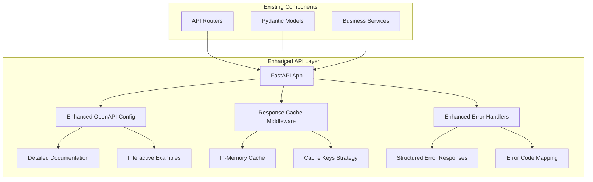

# API Layer Enhancements - Technical Design

## Architecture Overview

This design enhances the existing FastAPI application with three core improvements while maintaining backward compatibility and clean architecture principles.



## Component Design

### 1. Enhanced OpenAPI Documentation

#### Implementation Approach
- Enhance FastAPI app configuration with comprehensive metadata
- Add detailed docstrings to all router endpoints
- Create example request/response objects
- Configure OpenAPI schema customization

#### Files to Modify
- `src/presentation/api/main.py` - Enhanced FastAPI configuration
- `src/presentation/api/routers/*.py` - Add comprehensive docstrings
- `src/presentation/api/models/examples.py` - New file for example data

#### Technical Details
```python
# Enhanced FastAPI configuration
app = FastAPI(
    title="Pro-Forma Analytics API",
    description="""
    Production-ready REST API for real estate DCF analysis and investment modeling.
    
    ## Features
    - Complete 4-phase DCF analysis workflow
    - Monte Carlo simulation with economic correlations
    - Prophet-based time series forecasting
    - Market data access for 5 major MSAs
    
    ## Authentication
    All endpoints (except health check) require API key authentication via X-API-Key header.
    """,
    version="1.5.0",
    contact={
        "name": "Pro-Forma Analytics API",
        "url": "https://github.com/your-org/pro-forma-analytics-tool",
    },
    license_info={
        "name": "MIT License",
        "url": "https://opensource.org/licenses/MIT",
    },
    docs_url="/api/v1/docs",
    redoc_url="/api/v1/redoc",
    openapi_url="/api/v1/openapi.json"
)
```

#### Example Enhancement Strategy
```python
@router.post(
    "/dcf",
    response_model=DCFAnalysisResponse,
    status_code=status.HTTP_200_OK,
    summary="Perform DCF Analysis on Property",
    description="""
    Analyze a real estate property through complete 4-phase DCF workflow:
    
    1. **DCF Assumptions**: Monte Carlo scenario mapping
    2. **Initial Numbers**: Acquisition costs and financing
    3. **Cash Flow Projections**: 6-year cash flow modeling
    4. **Financial Metrics**: NPV, IRR, and investment recommendations
    
    Returns comprehensive investment analysis with risk assessment.
    """,
    responses={
        200: {
            "description": "Successful DCF analysis",
            "content": {
                "application/json": {
                    "example": EXAMPLE_DCF_RESPONSE
                }
            }
        },
        400: {
            "description": "Invalid property data",
            "content": {
                "application/json": {
                    "example": EXAMPLE_VALIDATION_ERROR
                }
            }
        }
    }
)
```

### 2. Response Caching

#### Implementation Approach
- Create lightweight in-memory cache middleware
- Implement cache key strategy based on endpoint and parameters
- Add cache headers for client-side caching
- Configurable TTL per endpoint type

#### Architecture
```python
class ResponseCacheMiddleware:
    def __init__(self, app, cache_config: Dict[str, int]):
        self.app = app
        self.cache = {}  # In-memory cache
        self.cache_config = cache_config  # TTL per endpoint pattern
        
    async def __call__(self, scope, receive, send):
        # Check if request is cacheable
        # Generate cache key
        # Return cached response if available and fresh
        # Store response in cache after processing
```

#### Cache Strategy
- **Market Data**: 15 minutes TTL (data changes infrequently)
- **Forecast Data**: 30 minutes TTL (Prophet forecasts are computationally expensive)
- **System Config**: 60 minutes TTL (configuration rarely changes)
- **Health Check**: No caching (real-time status needed)
- **Analysis Endpoints**: No caching (unique per request)

#### Cache Key Generation
```python
def generate_cache_key(method: str, path: str, query_params: dict) -> str:
    """Generate deterministic cache key for request"""
    # Format: method:path:sorted_query_params_hash
    return f"{method}:{path}:{hash(frozenset(query_params.items()))}"
```

### 3. Enhanced Error Responses

#### Implementation Approach
- Create comprehensive error response models
- Implement custom exception handlers
- Add error code mapping for programmatic handling
- Include actionable suggestions in error responses

#### Error Response Structure
```python
class EnhancedErrorResponse(BaseModel):
    error_code: str
    message: str
    details: Optional[Dict[str, Any]] = None
    suggestions: List[str] = []
    documentation_url: Optional[str] = None
    timestamp: datetime
    request_id: str
    path: str
    
class ValidationErrorResponse(EnhancedErrorResponse):
    field_errors: Dict[str, List[str]]
    invalid_fields: List[str]
    example_valid_request: Optional[Dict[str, Any]] = None
```

#### Error Code Mapping
```python
ERROR_SUGGESTIONS = {
    "validation_error": [
        "Check required fields are provided",
        "Verify data types match API specification",
        "Review field validation rules in documentation"
    ],
    "authentication_failed": [
        "Ensure X-API-Key header is included",
        "Verify API key is valid and active",
        "Check API key has sufficient permissions"
    ],
    "calculation_error": [
        "Verify property data values are realistic",
        "Check MSA code is supported (35620, 31080, 16980, 47900, 33100)",
        "Ensure all required financial parameters are provided"
    ]
}
```

## Data Models

### Example Data Objects
Create comprehensive example objects for documentation:

```python
# src/presentation/api/models/examples.py
EXAMPLE_PROPERTY_REQUEST = {
    "property_data": {
        "property_id": "NYC_MULTI_001",
        "property_name": "Brooklyn Heights Multifamily",
        "analysis_date": "2025-07-31",
        "residential_units": {
            "total_units": 24,
            "average_rent_per_unit": 3200,
            "unit_types": "Mix: 12x1BR ($2,800), 12x2BR ($3,600)"
        },
        "renovation_info": {
            "status": "major_renovation",
            "anticipated_duration_months": 8
        },
        "equity_structure": {
            "investor_equity_share_pct": 80.0,
            "self_cash_percentage": 25.0,
            "number_of_investors": 3
        },
        "city": "Brooklyn",
        "state": "NY",
        "purchase_price": 4500000.0
    },
    "options": {
        "monte_carlo_simulations": 5000,
        "forecast_horizon_years": 6,
        "include_scenarios": True,
        "confidence_level": 0.95,
        "detailed_cash_flows": True
    }
}
```

## Error Handling Strategy

### Custom Exception Classes
```python
class APIException(HTTPException):
    def __init__(self, status_code: int, error_code: str, message: str, 
                 suggestions: List[str] = None, details: Dict = None):
        self.error_code = error_code
        self.suggestions = suggestions or []
        self.details = details or {}
        super().__init__(status_code=status_code, detail=message)
```

### Exception Handler Registration
```python
@app.exception_handler(ValidationException)
async def validation_exception_handler(request: Request, exc: ValidationException):
    return JSONResponse(
        status_code=422,
        content=EnhancedErrorResponse(
            error_code="validation_error",
            message=str(exc),
            suggestions=ERROR_SUGGESTIONS["validation_error"],
            field_errors=exc.field_errors,
            example_valid_request=get_example_for_endpoint(request.url.path),
            timestamp=datetime.utcnow(),
            request_id=getattr(request.state, "request_id", "unknown"),
            path=request.url.path
        ).dict()
    )
```

## Performance Considerations

### Cache Memory Management
- Implement LRU eviction policy for cache size management
- Maximum cache size: 100MB
- Cache metrics for monitoring hit/miss ratios

### Response Time Targets
- Cached responses: < 50ms
- Cold requests: No degradation from current performance
- Cache overhead: < 5ms additional processing time

## Testing Strategy

### Unit Tests
- Cache middleware functionality
- Error response formatting
- Example data validation

### Integration Tests
- End-to-end caching behavior
- Enhanced error response formats
- Documentation accessibility

### Performance Tests
- Cache hit/miss scenarios
- Memory usage under load
- Response time validation

## Implementation Phases

### Phase 1: Enhanced OpenAPI Documentation
1. Update FastAPI configuration with comprehensive metadata
2. Add detailed docstrings to all router endpoints
3. Create example request/response objects
4. Test documentation accessibility and accuracy

### Phase 2: Response Caching
1. Implement cache middleware
2. Add cache configuration
3. Integrate with existing middleware stack
4. Test cache behavior and performance

### Phase 3: Enhanced Error Responses
1. Create enhanced error response models
2. Implement custom exception handlers
3. Add error code mapping and suggestions
4. Test error scenarios and response formats

## Backward Compatibility

All enhancements maintain complete backward compatibility:
- No changes to existing endpoint URLs or response structures
- All existing API contracts remain unchanged
- Enhanced documentation is additive only
- Caching is transparent to clients
- Error responses maintain existing fields while adding new ones

## Configuration

### Environment Variables
```python
# Cache configuration
API_CACHE_MARKET_DATA_TTL=900  # 15 minutes
API_CACHE_FORECAST_TTL=1800    # 30 minutes  
API_CACHE_CONFIG_TTL=3600      # 60 minutes
API_CACHE_MAX_SIZE_MB=100      # Maximum cache size

# Documentation configuration
API_DOCS_CONTACT_URL="https://github.com/your-org/pro-forma-analytics-tool"
API_DOCS_LICENSE="MIT"
```

This design provides a comprehensive approach to enhancing the API layer while maintaining the existing clean architecture and ensuring all improvements are high-impact and low-effort to implement.