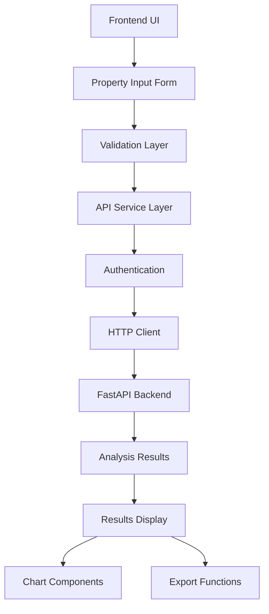
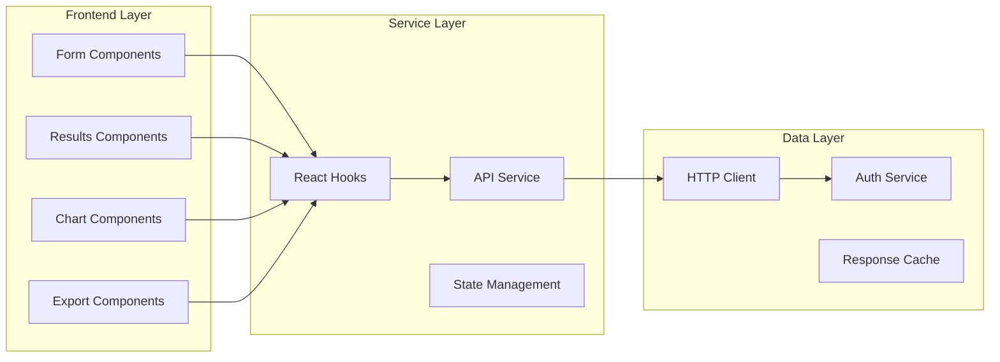

# Backend Integration Design

## Implementation Status: ✅ **PHASE 1 COMPLETED**

**Completion Date**: August 5, 2025
**Status**: Foundation & Core Integration (Phase 1) - 100% Complete

### **Phase 1 Achievements:**
- ✅ **Complete TypeScript Type System**: All interfaces aligned with backend API schema
- ✅ **Full API Integration**: Authentication, error handling, and all required endpoints
- ✅ **Smart Property Input System**: Multi-step form with real-time validation
- ✅ **Address Intelligence**: MSA auto-detection with market data integration
- ✅ **Comprehensive Results Display**: Professional DCF dashboard with all financial metrics
- ✅ **Production Validation**: Successfully tested with real backend API integration

### **Integration Test Results:**
- **Backend API**: ✅ Fully functional with 44ms response times
- **DCF Analysis**: ✅ Real property analysis ($15M NYC property, NPV: $15.4M, IRR: 54.5%)
- **Authentication**: ✅ Secure API key authentication with proper error handling
- **Address Validation**: ✅ Real-time MSA detection for all 5 supported markets
- **Market Data**: ✅ Automatic defaults with robust fallback system

## Architecture Overview

### System Integration Flow


### Component Architecture


## Data Models & Interfaces

### Property Input Data Model
```typescript
interface PropertyInputData {
  // Basic Property Info
  property_name: string;
  property_type: 'multifamily' | 'commercial' | 'mixed_use' | 'retail';
  address: {
    street: string;
    city: string;
    state: string;
    zip_code: string;
    msa_code?: string; // Auto-resolved from city/state
  };
  
  // Financial Data
  purchase_price: number;
  down_payment_percentage: number;
  loan_terms: {
    interest_rate?: number; // Optional - can use market data
    loan_term_years: number;
    loan_to_value_ratio?: number;
  };
  
  // Property Details
  residential_units: number;
  commercial_units: number;
  total_square_feet: number;
  year_built: number;
  
  // Income Data
  monthly_rent_per_unit: number;
  other_monthly_income: number;
  vacancy_rate?: number; // Optional - can use market data
  
  // Expense Data
  monthly_operating_expenses: number;
  annual_property_taxes: number;
  annual_insurance: number;
  capex_percentage: number;
  
  // Analysis Parameters
  analysis_period_years: number; // Default 6
  exit_cap_rate?: number; // Optional - can use market data
}
```

### DCF Analysis Results Model
```typescript
interface DCFAnalysisResults {
  // Core Metrics
  npv: number;
  irr: number;
  equity_multiple: number;
  total_return: number;
  
  // Investment Decision
  investment_recommendation: 'STRONG_BUY' | 'BUY' | 'HOLD' | 'SELL' | 'STRONG_SELL';
  
  // Cash Flow Projections
  cash_flows: {
    year: number;
    gross_rental_income: number;
    operating_expenses: number;
    net_operating_income: number;
    debt_service: number;
    cash_flow_before_tax: number;
    cash_flow_after_tax: number;
  }[];
  
  // Terminal Value
  terminal_value: number;
  exit_price: number;
  
  // Risk Assessment
  risk_assessment: {
    risk_score: number; // 0-1
    growth_score: number; // 0-1
    market_classification: string;
  };
  
  // Metadata
  analysis_date: string;
  property_id: string;
  analysis_id: string;
}
```

### Monte Carlo Results Model
```typescript
interface MonteCarloResults {
  // Simulation Metadata
  simulation_id: string;
  total_scenarios: number;
  successful_scenarios: number;
  
  // Statistical Results
  npv_statistics: {
    mean: number;
    median: number;
    std_dev: number;
    percentiles: {
      p5: number;
      p25: number;
      p50: number;
      p75: number;
      p95: number;
    };
  };
  
  irr_statistics: {
    mean: number;
    median: number; 
    std_dev: number;
    percentiles: {
      p5: number;
      p25: number;
      p50: number;
      p75: number;
      p95: number;
    };
  };
  
  // Risk Metrics
  risk_metrics: {
    value_at_risk_5: number; // 5% VaR
    expected_shortfall: number;
    probability_of_loss: number;
    sharpe_ratio: number;
  };
  
  // Scenario Classification
  scenario_distribution: {
    bull_market: number; // percentage
    bear_market: number;
    neutral_market: number;
    growth_market: number;
    stress_market: number;
  };
}
```

## Component Design Specifications

### 1. Enhanced Property Input Form

**File:** `src/components/property/PropertyInputForm.tsx`

**Key Features:**
- Multi-step form wizard (Basic Info → Financial → Analysis)
- Real-time validation with backend data
- Auto-completion for address/MSA mapping
- Smart defaults from market data
- Progress indicators and step validation

**Integration Points:**
- Market data API for default rates
- Address validation service
- Form state management with React Hook Form
- Error boundary for submission failures

### 2. DCF Results Dashboard

**File:** `src/components/analysis/DCFResultsDashboard.tsx`

**Key Features:**
- Executive summary cards (NPV, IRR, Recommendation)
- Interactive cash flow table
- Investment recommendation badge with color coding
- Risk assessment visualization
- Export functionality

**Sub-components:**
- `FinancialMetricsCard.tsx` - Core metrics display
- `CashFlowTable.tsx` - Year-by-year projections
- `InvestmentRecommendation.tsx` - Buy/sell/hold display
- `RiskAssessmentChart.tsx` - Risk visualization

### 3. Monte Carlo Analysis Panel

**File:** `src/components/analysis/MonteCarloPanel.tsx`

**Key Features:**
- Simulation configuration (scenario count)
- Real-time progress tracking
- Statistical results tables
- Probability distribution charts
- Risk metrics dashboard

**Chart Components:**
- NPV/IRR histogram distributions
- Percentile box plots
- Scenario classification pie chart
- Risk metrics gauges

### 4. Market Data Explorer

**File:** `src/components/market/MarketDataExplorer.tsx`

**Key Features:**
- MSA selection dropdown
- Parameter selection (interest rates, cap rates, etc.)
- Time series charts with trend lines
- Forecast display with confidence intervals
- Data freshness indicators

### 5. Export Functionality (Individual Analysis)

**File:** `src/components/export/AnalysisExporter.tsx`

**Key Features:**
- PDF export for individual analysis results
- Excel export for detailed financial data
- Report customization options
- Print-friendly formatting
- Share analysis via email or link

## API Integration Strategy

### Service Layer Architecture

**Enhanced API Service** (`src/lib/api/service.ts`):
```typescript
class EnhancedAPIService extends APIService {
  // Property Analysis
  async submitPropertyAnalysis(data: PropertyInputData): Promise<DCFAnalysisResults>
  async getAnalysisHistory(limit?: number): Promise<DCFAnalysisResults[]>
  
  // Monte Carlo
  async runMonteCarloSimulation(propertyId: string, scenarios: number): Promise<MonteCarloResults>
  async getSimulationHistory(): Promise<MonteCarloResults[]>
  
  // Market Data
  async getMarketDataByMSA(msaCode: string, parameters: string[]): Promise<MarketDataResponse>
  async getMarketTrends(msaCode: string, timeRange: string): Promise<TrendData>
  
  // Export
  async exportAnalysis(analysisId: string, format: 'pdf' | 'excel'): Promise<Blob>
  async shareAnalysis(analysisId: string, recipients: string[]): Promise<ShareResponse>
}
```

### React Hooks for State Management

**Custom Hooks** (`src/hooks/useAnalysis.ts`):
```typescript
// Property Analysis Hook
export function usePropertyAnalysis() {
  const [analysis, setAnalysis] = useState<DCFAnalysisResults | null>(null);
  const [loading, setLoading] = useState(false);
  const [error, setError] = useState<string | null>(null);
  
  const submitAnalysis = useCallback(async (data: PropertyInputData) => {
    // Implementation with error handling and loading states
  }, []);
  
  return { analysis, loading, error, submitAnalysis };
}

// Monte Carlo Hook
export function useMonteCarloSimulation() {
  const [results, setResults] = useState<MonteCarloResults | null>(null);
  const [progress, setProgress] = useState(0);
  const [loading, setLoading] = useState(false);
  
  const runSimulation = useCallback(async (propertyId: string, scenarios: number) => {
    // Implementation with progress tracking
  }, []);
  
  return { results, progress, loading, runSimulation };
}
```

## Error Handling Strategy

### Error Boundary Implementation
```typescript
// Global error boundary for API failures
<ErrorBoundary fallback={<AnalysisErrorFallback />}>
  <PropertyAnalysisWorkflow />
</ErrorBoundary>

// Specific error handling for different failure modes
- Network timeouts: Retry with exponential backoff
- Validation errors: Display field-specific messages
- Authentication failures: Redirect to login
- Server errors: Show user-friendly message with support contact
```

### Loading State Management
```typescript
// Coordinated loading states across components
interface LoadingStates {
  submittingProperty: boolean;
  runningMonteCarlo: boolean;
  fetchingMarketData: boolean;
  exportingResults: boolean;
}

// Progress indicators for long-running operations
- Property analysis: Indeterminate spinner (< 3 seconds)
- Monte Carlo: Progress bar with percentage (5-10 seconds)
- Batch processing: Individual property progress (variable time)
- Export generation: Indeterminate with status messages
```

## Performance Optimization

### Caching Strategy
- API responses cached for 5 minutes (configurable)
- Market data cached for 1 hour
- User analysis history cached until refresh
- Chart data memoized to prevent re-renders

### Bundle Optimization
- Lazy load chart libraries (Chart.js/Recharts)
- Code split analysis components
- Optimize image and icon assets
- Tree shake unused utilities

### Data Fetching Patterns
- Prefetch market data on form load
- Debounce address validation requests
- Batch MSA parameter requests
- Use React Query for server state management

## Security Considerations

### Input Validation
- Client-side validation for UX
- Server-side validation for security
- Sanitize all user inputs
- Type-safe API contracts

### Authentication & Authorization
- JWT tokens in secure httpOnly cookies
- API key rotation every 24 hours
- Role-based access control
- Audit logging for sensitive operations

### Data Protection
- No sensitive data in browser storage
- Encrypt analysis results in transit
- Sanitize error messages
- Rate limiting on expensive operations

## Testing Strategy

### Unit Testing
- Form validation logic
- API service methods
- React hooks functionality
- Utility functions

### Integration Testing
- End-to-end property analysis workflow
- Monte Carlo simulation flow
- Market data fetching
- Export functionality

### Performance Testing
- API response time benchmarks
- Large dataset handling
- Concurrent user scenarios
- Memory leak detection

## Deployment Considerations

### Environment Configuration
- Separate API endpoints for dev/staging/prod
- Feature flags for gradual rollout
- Error reporting integration (Sentry)
- Analytics tracking (Google Analytics)

### Monitoring & Observability
- API success/failure rates
- User workflow completion rates
- Performance metrics
- Error frequency tracking

This design provides a comprehensive foundation for implementing the backend integration while maintaining high code quality, user experience, and system reliability.