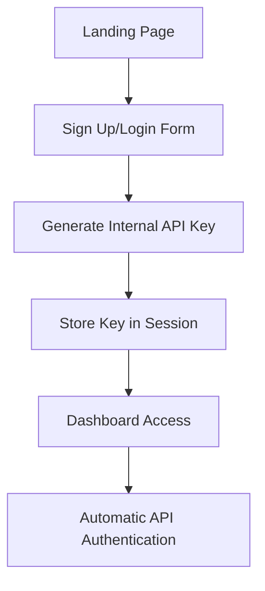
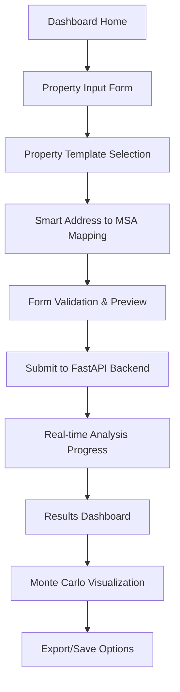

# React/Next.js Financial Dashboard - Technical Design Specification

## Design Overview

This specification outlines the technical architecture for a React/Next.js frontend that transforms the production-ready FastAPI backend into an accessible, modern financial dashboard with NYT/Claude Artifacts aesthetic inspiration.

## Architecture Philosophy

### NYT Dashboard + Claude Artifacts Aesthetic
- **Clean Typography**: Inter font family with carefully crafted hierarchy
- **Purposeful Whitespace**: Generous margins, focused content areas
- **Subtle Depth**: Soft shadows, elevated cards, layered information
- **Data-First Design**: UI disappears, financial metrics take center stage
- **Professional Polish**: Banking-grade visual quality with consumer UX

### Technical Architecture

```
Frontend (Next.js 14)
├── app/                     # App Router structure
│   ├── (dashboard)/         # Dashboard route group
│   ├── auth/               # Authentication pages  
│   └── api/                # API proxy routes
├── components/
│   ├── ui/                 # shadcn/ui base components
│   ├── forms/              # Property input forms
│   ├── charts/             # Financial visualizations
│   ├── cards/              # Metric display cards
│   └── layout/             # Dashboard shell
├── lib/
│   ├── api/                # FastAPI client integration
│   ├── auth/               # Simple user authentication
│   └── utils/              # Utilities and helpers
└── types/                  # TypeScript definitions
```

## User Experience Flow

### Authentication Flow (Simplified)


**Implementation Notes:**
- No manual API key entry for users
- Simple email/password registration
- Backend generates and manages API keys automatically
- Session-based authentication with secure API key storage

### Property Analysis Workflow


## Component Architecture

### Core Component Hierarchy

```typescript
// App Shell
<DashboardLayout>
  <Sidebar />
  <Header />
  <MainContent>
    // Route-specific content
    <PropertyForm />
    <AnalysisResults />
    <MonteCarloVisualization />
  </MainContent>
</DashboardLayout>
```

### Component Library Structure

#### 1. UI Foundation (shadcn/ui based)
```typescript
// components/ui/
- Button, Input, Select, Textarea
- Card, Badge, Progress, Spinner
- Dialog, Sheet, Popover, Tooltip
- Table, Pagination, Tabs
- Form components with validation
```

#### 2. Financial Components
```typescript
// components/financial/
- MetricCard: NPV, IRR, Equity Multiple display
- ProgressRing: Animated metric visualization
- TrendIndicator: Up/down arrows with percentages
- RecommendationBadge: STRONG_BUY to STRONG_SELL styling
```

#### 3. Chart Components
```typescript
// components/charts/
- CashFlowChart: 6-year projection line chart
- MonteCarloScatter: Interactive scenario distribution
- MetricsBarChart: Comparative analysis
- MarketDataChart: Interest rates, cap rates over time
```

#### 4. Form Components
```typescript
// components/forms/
- PropertyInputForm: Multi-step wizard
- PropertyTemplate: Pre-configured property types
- AddressInput: Smart MSA detection
- FinancialInputs: Currency formatting, validation
```

## Data Management Architecture

### API Integration Layer

```typescript
// lib/api/client.ts
class FastAPIClient {
  private baseURL: string;
  private apiKey: string;
  
  async analyzeDCF(propertyData: SimplifiedPropertyInput): Promise<DCFResults>
  async runMonteCarloSimulation(scenarios: number): Promise<MonteCarloResults>
  async getMarketData(msaCode: string): Promise<MarketData>
  async getBatchAnalysis(properties: SimplifiedPropertyInput[]): Promise<BatchResults>
}
```

### State Management Strategy

**React Query (TanStack Query) for Server State:**
```typescript
// hooks/usePropertyAnalysis.ts
export function usePropertyAnalysis(propertyData: SimplifiedPropertyInput) {
  return useQuery({
    queryKey: ['dcf-analysis', propertyData.property_id],
    queryFn: () => fastAPIClient.analyzeDCF(propertyData),
    staleTime: 5 * 60 * 1000, // 5 minutes
    enabled: !!propertyData.property_id
  });
}
```

**Zustand for Client State:**
```typescript
// lib/store/propertyStore.ts
interface PropertyStore {
  currentProperty: SimplifiedPropertyInput | null;
  properties: SimplifiedPropertyInput[];
  selectedTemplate: PropertyTemplate;
  formStep: number;
  
  setCurrentProperty: (property: SimplifiedPropertyInput) => void;
  addProperty: (property: SimplifiedPropertyInput) => void;
  setTemplate: (template: PropertyTemplate) => void;
  nextStep: () => void;
}
```

## Property Template System

### Template Definitions
```typescript
// lib/templates/propertyTemplates.ts
export interface PropertyTemplate {
  id: string;
  name: string;
  description: string;
  icon: React.ComponentType;
  defaults: Partial<SimplifiedPropertyInput>;
  requiredFields: string[];
  helpText: Record<string, string>;
}

export const PROPERTY_TEMPLATES: PropertyTemplate[] = [
  {
    id: 'multifamily-residential',
    name: 'Multifamily Residential',
    description: 'Apartment buildings, condos, residential complexes',
    icon: Building2Icon,
    defaults: {
      commercial_units: null,
      renovation_info: { status: RenovationStatus.NOT_NEEDED }
    },
    requiredFields: ['residential_units', 'equity_structure'],
    helpText: {
      residential_units: 'Total apartment units in the building'
    }
  },
  {
    id: 'commercial-office',
    name: 'Commercial Office',
    description: 'Office buildings, business centers, co-working spaces',
    icon: OfficeIcon,
    defaults: {
      residential_units: { total_units: 0, average_rent_per_unit: 0 },
      commercial_units: { total_units: 10, average_rent_per_unit: 5000 }
    }
  },
  {
    id: 'mixed-use',
    name: 'Mixed-Use Property',
    description: 'Residential units with ground-floor commercial space',
    icon: BuildingIcon,
    defaults: {
      residential_units: { total_units: 8, average_rent_per_unit: 2800 },
      commercial_units: { total_units: 2, average_rent_per_unit: 4200 }
    }
  },
  {
    id: 'retail-shopping',
    name: 'Retail & Shopping',
    description: 'Strip malls, shopping centers, standalone retail',
    icon: ShoppingCartIcon,
    defaults: {
      residential_units: { total_units: 0, average_rent_per_unit: 0 },
      commercial_units: { total_units: 5, average_rent_per_unit: 3500 }
    }
  }
];
```

## Address to MSA Mapping System

### Smart Location Detection
```typescript
// lib/location/msaMapping.ts
interface LocationService {
  detectMSAFromAddress(address: string): Promise<MSAInfo | null>;
  validateAddress(address: string): Promise<AddressValidation>;
  getSupportedMSAs(): MSAInfo[];
}

// Phase 1: Simple dropdown selection
// Phase 2: Google Places API integration (future)
export class MSAMappingService implements LocationService {
  async detectMSAFromAddress(address: string): Promise<MSAInfo | null> {
    // Extract city/state from address
    const cityState = this.parseAddress(address);
    
    // Match against supported MSAs
    return this.findMSAByLocation(cityState);
  }
}
```

### Supported MSAs (Based on Current Data)
```typescript
// From msa_config.py analysis
export const SUPPORTED_MSAS = [
  { code: '16740', name: 'Charlotte-Concord-Gastonia', state: 'NC-SC' },
  { code: '39580', name: 'Raleigh-Cary', state: 'NC' },
  { code: '24660', name: 'Greensboro-High Point', state: 'NC' },
  { code: '20500', name: 'Durham-Chapel Hill', state: 'NC' },
  // Expansion MSAs from config
  { code: '35620', name: 'New York-Newark-Jersey City', state: 'NY-NJ-PA' },
  { code: '31080', name: 'Los Angeles-Long Beach-Anaheim', state: 'CA' },
  { code: '16980', name: 'Chicago-Naperville-Elgin', state: 'IL-IN-WI' }
];
```

## Authentication System Design

### Simple User Management
```typescript
// lib/auth/authSystem.ts
interface User {
  id: string;
  email: string;
  createdAt: Date;
  fastAPIKey: string; // Generated and managed automatically
}

interface AuthService {
  register(email: string, password: string): Promise<User>;
  login(email: string, password: string): Promise<User>;
  logout(): Promise<void>;
  getCurrentUser(): User | null;
  generateAPIKey(): Promise<string>;
}
```

### Session Management
```typescript
// lib/auth/sessionManager.ts
export class SessionManager {
  private user: User | null = null;
  
  async authenticateWithBackend(): Promise<boolean> {
    // Use stored API key for all FastAPI requests
    const apiKey = this.user?.fastAPIKey;
    return fastAPIClient.setAPIKey(apiKey);
  }
}
```

## Visual Design System

### Typography Scale (NYT/Claude Inspired)
```css
:root {
  /* Font Family */
  --font-primary: Inter, -apple-system, BlinkMacSystemFont, sans-serif;
  
  /* Font Sizes */
  --text-xs: 0.75rem;    /* 12px - Captions, small labels */
  --text-sm: 0.875rem;   /* 14px - Body text, form labels */
  --text-base: 1rem;     /* 16px - Default body text */
  --text-lg: 1.125rem;   /* 18px - Emphasized text */
  --text-xl: 1.25rem;    /* 20px - Card titles */
  --text-2xl: 1.5rem;    /* 24px - Section headers */
  --text-3xl: 1.875rem;  /* 30px - Page titles */
  --text-4xl: 2.25rem;   /* 36px - Display numbers (NPV, IRR) */
  
  /* Font Weights */
  --font-normal: 400;
  --font-medium: 500;
  --font-semibold: 600;
  --font-bold: 700;
}
```

### Color Palette (Professional Financial)
```css
:root {
  /* Neutral Palette */
  --gray-50: #fafafa;
  --gray-100: #f5f5f5;
  --gray-200: #e5e5e5;
  --gray-300: #d4d4d4;
  --gray-400: #a3a3a3;
  --gray-500: #737373;
  --gray-600: #525252;
  --gray-700: #404040;
  --gray-800: #262626;
  --gray-900: #171717;
  
  /* Financial Status Colors */
  --emerald-50: #ecfdf5;   /* Positive metric backgrounds */
  --emerald-500: #10b981;  /* Positive values (NPV, IRR) */
  --emerald-600: #059669;  /* STRONG_BUY badges */
  
  --red-50: #fef2f2;       /* Negative metric backgrounds */
  --red-500: #ef4444;      /* Negative values, warnings */
  --red-600: #dc2626;      /* STRONG_SELL badges */
  
  --blue-50: #eff6ff;      /* Interactive backgrounds */
  --blue-500: #3b82f6;     /* Primary actions, links */
  --blue-600: #2563eb;     /* Button hover states */
  
  --amber-50: #fffbeb;     /* Warning backgrounds */
  --amber-500: #f59e0b;    /* Neutral recommendations */
}
```

### Component Styling Standards
```css
/* Card Component */
.metric-card {
  background: white;
  border-radius: 12px;
  border: 1px solid var(--gray-200);
  box-shadow: 0 1px 3px rgba(0, 0, 0, 0.05);
  padding: 24px;
  transition: all 0.2s ease;
}

.metric-card:hover {
  box-shadow: 0 4px 12px rgba(0, 0, 0, 0.08);
  transform: translateY(-1px);
}

/* Financial Value Display */
.financial-value {
  font-family: var(--font-primary);
  font-weight: var(--font-bold);
  letter-spacing: -0.025em;
  color: var(--gray-900);
}

.financial-value.positive {
  color: var(--emerald-600);
}

.financial-value.negative {
  color: var(--red-600);
}
```

## Chart Visualization Architecture

### Chart Library Selection: Recharts
**Rationale**: React-native charts with excellent TypeScript support, smaller bundle than D3.js, perfect for financial data visualization.

```typescript
// components/charts/CashFlowChart.tsx
interface CashFlowChartProps {
  data: CashFlowProjection[];
  animated?: boolean;
  showTooltip?: boolean;
  height?: number;
}

export function CashFlowChart({ data, animated = true }: CashFlowChartProps) {
  return (
    <ResponsiveContainer width="100%" height={400}>
      <LineChart data={data} margin={{ top: 20, right: 30, left: 20, bottom: 5 }}>
        <CartesianGrid strokeDasharray="3 3" stroke="var(--gray-200)" />
        <XAxis 
          dataKey="year" 
          tick={{ fontSize: 12, fill: 'var(--gray-600)' }}
        />
        <YAxis 
          tick={{ fontSize: 12, fill: 'var(--gray-600)' }}
          tickFormatter={(value) => `$${(value / 1000).toFixed(0)}K`}
        />
        <Tooltip 
          formatter={(value: number) => [`$${value.toLocaleString()}`, 'Cash Flow']}
          labelStyle={{ color: 'var(--gray-900)' }}
        />
        <Line 
          type="monotone" 
          dataKey="netCashFlow" 
          stroke="var(--blue-500)" 
          strokeWidth={3}
          dot={{ fill: 'var(--blue-500)', strokeWidth: 2, r: 4 }}
          animationDuration={animated ? 2000 : 0}
        />
      </LineChart>
    </ResponsiveContainer>
  );
}
```

### Monte Carlo Scatter Plot
```typescript
// components/charts/MonteCarloScatter.tsx
export function MonteCarloScatter({ scenarios }: { scenarios: MonteCarloResult[] }) {
  const chartData = scenarios.map(scenario => ({
    npv: scenario.npv,
    irr: scenario.irr * 100, // Convert to percentage
    scenario_type: scenario.market_classification,
    growth_score: scenario.growth_score
  }));

  return (
    <ResponsiveContainer width="100%" height={500}>
      <ScatterChart data={chartData}>
        <CartesianGrid strokeDasharray="3 3" />
        <XAxis 
          type="number" 
          dataKey="npv" 
          name="NPV"
          tickFormatter={(value) => `$${(value / 1000000).toFixed(1)}M`}
        />
        <YAxis 
          type="number" 
          dataKey="irr" 
          name="IRR"
          tickFormatter={(value) => `${value.toFixed(1)}%`}
        />
        <Tooltip 
          formatter={(value, name) => [
            name === 'NPV' ? `$${value.toLocaleString()}` : `${value.toFixed(2)}%`,
            name
          ]}
        />
        <Scatter 
          dataKey="irr" 
          fill="var(--blue-500)"
          fillOpacity={0.6}
        />
      </ScatterChart>
    </ResponsiveContainer>
  );
}
```

## Performance Optimization Strategy

### Bundle Optimization
```typescript
// next.config.js
const nextConfig = {
  experimental: {
    optimizePackageImports: ['recharts', '@radix-ui/react-dialog']
  },
  compiler: {
    removeConsole: process.env.NODE_ENV === 'production'
  }
};
```

### Code Splitting Strategy
```typescript
// Dynamic imports for heavy components
const MonteCarloVisualization = dynamic(
  () => import('../components/charts/MonteCarloScatter'),
  { 
    loading: () => <ChartSkeleton />,
    ssr: false // Charts don't need SSR
  }
);
```

### Data Fetching Optimization
```typescript
// Pre-fetch common data
export async function generateStaticProps() {
  return {
    props: {
      supportedMSAs: await getMSAList(),
      propertyTemplates: PROPERTY_TEMPLATES
    },
    revalidate: 3600 // 1 hour
  };
}
```

## Testing Strategy

### Component Testing (Jest + React Testing Library)
```typescript
// __tests__/components/MetricCard.test.tsx
describe('MetricCard', () => {
  it('displays positive NPV with green styling', () => {
    render(<MetricCard title="NPV" value={7847901} type="currency" />);
    
    expect(screen.getByText('$7,847,901')).toBeInTheDocument();
    expect(screen.getByText('$7,847,901')).toHaveClass('text-emerald-600');
  });
  
  it('formats IRR as percentage', () => {
    render(<MetricCard title="IRR" value={0.648} type="percentage" />);
    
    expect(screen.getByText('64.8%')).toBeInTheDocument();
  });
});
```

### API Integration Testing
```typescript
// __tests__/api/fastapi-client.test.ts
describe('FastAPIClient', () => {
  it('successfully analyzes property DCF', async () => {
    const client = new FastAPIClient('test-api-key');
    const propertyData = createSampleProperty();
    
    const result = await client.analyzeDCF(propertyData);
    
    expect(result.npv).toBeGreaterThan(0);
    expect(result.irr).toBeGreaterThan(0);
    expect(result.recommendation).toMatch(/BUY|SELL|HOLD/);
  });
});
```

### E2E Testing (Playwright)
```typescript
// e2e/property-analysis.spec.ts
test('complete property analysis workflow', async ({ page }) => {
  await page.goto('/dashboard');
  
  // Fill property form
  await page.fill('[data-testid="property-name"]', 'Test Property');
  await page.selectOption('[data-testid="template-select"]', 'mixed-use');
  
  // Submit analysis
  await page.click('[data-testid="analyze-button"]');
  
  // Verify results
  await expect(page.locator('[data-testid="npv-value"]')).toBeVisible();
  await expect(page.locator('[data-testid="irr-value"]')).toBeVisible();
});
```

## Deployment Architecture

### Frontend Hosting Options
1. **Vercel** (Recommended): Native Next.js optimization, automatic deployments
2. **Netlify**: Good alternative with similar features
3. **AWS S3 + CloudFront**: More control, potentially lower costs

### Integration with FastAPI Backend
```typescript
// Environment-based API configuration
const API_CONFIG = {
  development: {
    baseURL: 'http://localhost:8000',
    wsURL: 'ws://localhost:8000'
  },
  production: {
    baseURL: process.env.NEXT_PUBLIC_API_URL,
    wsURL: process.env.NEXT_PUBLIC_WS_URL
  }
};
```

### Docker Integration (Optional)
```dockerfile
# Dockerfile.frontend
FROM node:18-alpine
WORKDIR /app
COPY package*.json ./
RUN npm ci --only=production
COPY . .
RUN npm run build
EXPOSE 3000
CMD ["npm", "start"]
```

## Security Considerations

### Input Validation
```typescript
// lib/validation/propertyValidation.ts
import { z } from 'zod';

export const PropertyInputSchema = z.object({
  property_name: z.string().min(1, 'Property name is required'),
  residential_units: z.object({
    total_units: z.number().min(1, 'Must have at least 1 unit'),
    average_rent_per_unit: z.number().min(0, 'Rent must be positive')
  }),
  equity_structure: z.object({
    investor_equity_share_pct: z.number().min(0).max(100),
    self_cash_percentage: z.number().min(0).max(100)
  })
});
```

### API Security
```typescript
// lib/api/security.ts
export class SecureAPIClient {
  private apiKey: string;
  
  constructor(apiKey: string) {
    this.apiKey = this.validateAPIKey(apiKey);
  }
  
  private validateAPIKey(key: string): string {
    if (!key || key.length < 32) {
      throw new Error('Invalid API key format');
    }
    return key;
  }
  
  private getHeaders(): HeadersInit {
    return {
      'Authorization': `Bearer ${this.apiKey}`,
      'Content-Type': 'application/json',
      'X-Requested-With': 'XMLHttpRequest'
    };
  }
}
```

## Implementation Phases

### Phase 1: MVP Core (2-3 weeks)
- Authentication system (simple email/register)
- Property input form with templates
- Basic DCF analysis display
- Single property workflow
- Responsive design foundation

### Phase 2: Visualizations (1-2 weeks)
- Cash flow charts (Recharts integration)
- Monte Carlo scatter plots
- Animated metric displays
- Export functionality

### Phase 3: Enhanced Features (2-3 weeks)
- Market data integration
- Advanced form validation
- Property comparison tools
- Performance optimizations

### Phase 4: Polish & Production (1 week)
- E2E testing completion
- Performance auditing
- Security review
- Production deployment

## Success Metrics

### Technical Metrics
- **Performance**: <3s initial page load, <2s analysis results
- **Bundle Size**: <500KB gzipped initial bundle
- **Accessibility**: WCAG 2.1 AA compliance
- **Test Coverage**: >90% component coverage, >80% E2E coverage

### User Experience Metrics
- **Form Completion Rate**: >95% for property input
- **Analysis Success Rate**: >99% API integration reliability
- **User Engagement**: Average session >10 minutes
- **Mobile Usability**: >85% mobile task completion rate

## Risk Mitigation

### Technical Risks
- **Chart Performance**: Use virtualization for large datasets
- **API Reliability**: Implement retry logic and error boundaries
- **Browser Compatibility**: Progressive enhancement strategy
- **Bundle Size**: Aggressive code splitting and tree shaking

### User Experience Risks
- **Complex Forms**: Multi-step wizard with clear progress
- **Analysis Wait Times**: Loading states and progress indicators
- **Mobile Experience**: Touch-optimized inputs and navigation
- **Error Handling**: User-friendly error messages with recovery options

This design specification provides the foundation for implementing a professional, NYT/Claude-inspired financial dashboard that leverages your production-ready FastAPI backend while delivering an exceptional user experience.