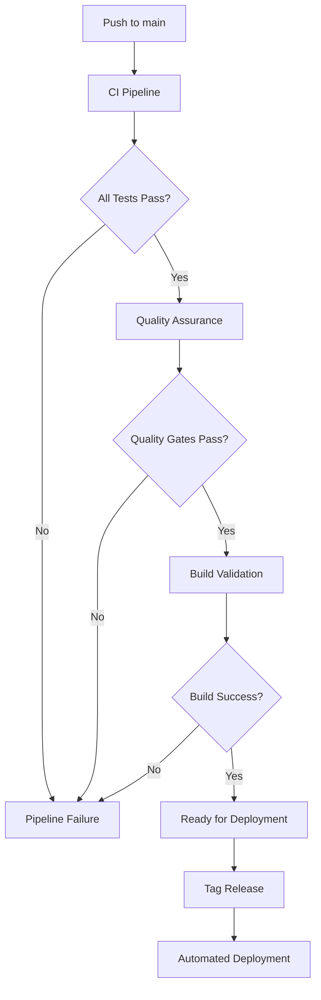

# Production Deployment Guide v1.3

## Overview

This document provides comprehensive production deployment instructions for the Pro-Forma Analytics Tool v1.3, including CI/CD pipeline configuration, quality gates, automated deployment processes, and infrastructure requirements.

## System Requirements

### Hardware Requirements

**Minimum Production Specifications**
- **CPU**: 4 cores, 2.5 GHz (Intel/AMD x64)
- **Memory**: 8 GB RAM (16 GB recommended)
- **Storage**: 20 GB available disk space (SSD recommended)
- **Network**: Stable internet connection for data updates

**Recommended Production Specifications**
- **CPU**: 8 cores, 3.0 GHz (Intel/AMD x64)
- **Memory**: 16 GB RAM (32 GB for high-volume processing)
- **Storage**: 50 GB SSD storage with backup capability
- **Network**: High-speed internet (>100 Mbps) for real-time data integration

### Software Requirements

**Operating System Support**
- **Linux**: Ubuntu 20.04+ LTS, CentOS 8+, RHEL 8+ (Recommended)
- **Windows**: Windows Server 2019+, Windows 10/11 Pro
- **macOS**: macOS 10.15+ (development/testing only)

**Python Environment**
- **Python Versions**: 3.8, 3.9, 3.10, 3.11, 3.13 (multi-version CI/CD validation)
- **Package Manager**: pip 21.0+ with virtual environment support
- **Virtual Environment**: venv, virtualenv, or conda

## Local Development Setup

### Quick Start Installation

```bash
# Clone the repository
git clone https://github.com/your-org/pro-forma-analytics-tool.git
cd pro-forma-analytics-tool

# Create and activate virtual environment
python -m venv venv
source venv/bin/activate  # Linux/macOS
# venv\Scripts\activate    # Windows

# Install dependencies
pip install --upgrade pip
pip install -r requirements.txt

# Initialize databases
python data_manager.py setup

# Validate installation
python demo_end_to_end_workflow.py

# Run comprehensive test suite
pytest tests/ -v --cov=src --cov=core --cov=monte_carlo --cov-fail-under=96
```

### Development Environment Configuration

**Pre-commit Hooks Setup**
```bash
# Install pre-commit hooks for code quality
pip install pre-commit
pre-commit install

# Run all pre-commit checks
pre-commit run --all-files
```

**Environment Variables**
```bash
# Create .env file for local development
cat > .env << EOF
ENVIRONMENT=development
LOG_LEVEL=DEBUG
DATABASE_PATH=./data/databases
CACHE_TTL_HOURS=1
PERFORMANCE_PROFILING=true
EOF
```

## CI/CD Pipeline Architecture

### GitHub Actions Workflows

The project uses a comprehensive CI/CD pipeline with three main workflows:

#### 1. Continuous Integration (`.github/workflows/ci.yml`)

**Multi-Python Version Testing**
```yaml
strategy:
  matrix:
    python-version: ['3.8', '3.9', '3.10', '3.11', '3.13']
    os: [ubuntu-latest, windows-latest]
```

**Quality Gates**
- **Code Formatting**: Black, isort validation
- **Linting**: flake8, mypy type checking
- **Testing**: 320+ tests with 96%+ coverage enforcement
- **Architecture**: Clean Architecture compliance validation
- **Performance**: IRR calculation speed benchmarking (<0.01ms)
- **End-to-End**: Complete DCF workflow validation

#### 2. Quality Assurance (`.github/workflows/quality.yml`)

**Advanced Code Quality**
- **Complexity Analysis**: radon, cyclomatic complexity checking
- **Security Scanning**: bandit, safety, pip-audit
- **Documentation**: pydocstyle, link validation
- **Dead Code Detection**: vulture analysis
- **Dependency Auditing**: Vulnerability and outdated package detection

#### 3. Release Pipeline (`.github/workflows/release.yml`)

**Automated Release Process**
- **Semantic Versioning**: Automated version tagging
- **Package Building**: Python wheel and source distribution
- **Release Notes**: Auto-generated from commit history
- **Artifact Storage**: Build artifacts and performance reports
- **Security Validation**: Final vulnerability assessment

### Pipeline Execution Flow



## Production Deployment Options

### Option 1: Docker Containerization (Recommended)

**Dockerfile**
```dockerfile
FROM python:3.11-slim

# Set working directory
WORKDIR /app

# Install system dependencies
RUN apt-get update && apt-get install -y \
    gcc \
    sqlite3 \
    && rm -rf /var/lib/apt/lists/*

# Copy requirements and install Python dependencies
COPY requirements.txt .
RUN pip install --no-cache-dir -r requirements.txt

# Copy application code
COPY . .

# Initialize databases
RUN python data_manager.py setup

# Create non-root user
RUN useradd -m -u 1000 appuser && chown -R appuser:appuser /app
USER appuser

# Expose port for API (future)
EXPOSE 8000

# Health check
HEALTHCHECK --interval=30s --timeout=10s --start-period=60s --retries=3 \
    CMD python -c "from demo_end_to_end_workflow import main; main()" || exit 1

# Run application
CMD ["python", "demo_end_to_end_workflow.py"]
```

**Docker Compose Configuration**
```yaml
version: '3.8'

services:
  pro-forma-analytics:
    build: .
    ports:
      - "8000:8000"
    environment:
      - ENVIRONMENT=production
      - LOG_LEVEL=INFO
    volumes:
      - ./data:/app/data
      - ./logs:/app/logs
    restart: unless-stopped
    healthcheck:
      test: ["CMD", "python", "-c", "from demo_end_to_end_workflow import main; main()"]
      interval: 30s
      timeout: 10s
      retries: 3
      start_period: 60s

  nginx:
    image: nginx:alpine
    ports:
      - "80:80"
      - "443:443"
    volumes:
      - ./nginx.conf:/etc/nginx/nginx.conf
      - ./ssl:/etc/nginx/ssl
    depends_on:
      - pro-forma-analytics
    restart: unless-stopped
```

**Build and Deploy**
```bash
# Build Docker image
docker build -t pro-forma-analytics:v1.3 .

# Run with Docker Compose
docker-compose up -d

# Validate deployment
docker-compose exec pro-forma-analytics python demo_end_to_end_workflow.py
```

### Option 2: Cloud Platform Deployment

#### AWS Deployment

**EC2 Instance Setup**
```bash
# Launch EC2 instance (Ubuntu 20.04 LTS)
# Instance type: t3.medium (minimum), t3.large (recommended)

# Connect and setup
ssh -i your-key.pem ubuntu@your-ec2-instance

# Update system
sudo apt update && sudo apt upgrade -y

# Install Python and dependencies
sudo apt install python3.11 python3.11-venv python3-pip sqlite3 nginx -y

# Clone and setup application
git clone https://github.com/your-org/pro-forma-analytics-tool.git
cd pro-forma-analytics-tool

# Setup virtual environment
python3.11 -m venv venv
source venv/bin/activate

# Install dependencies and initialize
pip install -r requirements.txt
python data_manager.py setup

# Run validation
python demo_end_to_end_workflow.py
```

**Systemd Service Configuration**
```ini
# /etc/systemd/system/pro-forma-analytics.service
[Unit]
Description=Pro-Forma Analytics Tool
After=network.target

[Service]
Type=simple
User=ubuntu
WorkingDirectory=/home/ubuntu/pro-forma-analytics-tool
Environment=PATH=/home/ubuntu/pro-forma-analytics-tool/venv/bin
ExecStart=/home/ubuntu/pro-forma-analytics-tool/venv/bin/python demo_end_to_end_workflow.py
Restart=always
RestartSec=10

[Install]
WantedBy=multi-user.target
```

```bash
# Enable and start service
sudo systemctl enable pro-forma-analytics.service
sudo systemctl start pro-forma-analytics.service
sudo systemctl status pro-forma-analytics.service
```

#### Azure Deployment

**Azure Container Instances**
```bash
# Create resource group
az group create --name pro-forma-analytics-rg --location eastus

# Create container instance
az container create \
  --resource-group pro-forma-analytics-rg \
  --name pro-forma-analytics \
  --image your-registry/pro-forma-analytics:v1.3 \
  --cpu 2 \
  --memory 4 \
  --restart-policy Always \
  --environment-variables ENVIRONMENT=production LOG_LEVEL=INFO
```

#### Google Cloud Platform

**Cloud Run Deployment**
```bash
# Build and push to Container Registry
gcloud builds submit --tag gcr.io/your-project/pro-forma-analytics:v1.3

# Deploy to Cloud Run
gcloud run deploy pro-forma-analytics \
  --image gcr.io/your-project/pro-forma-analytics:v1.3 \
  --platform managed \
  --region us-central1 \
  --memory 4Gi \
  --cpu 2 \
  --max-instances 10
```

### Option 3: Bare Metal/VM Deployment

**Production Server Setup**
```bash
# System preparation (Ubuntu 20.04 LTS)
sudo apt update && sudo apt upgrade -y
sudo apt install python3.11 python3.11-venv python3-pip sqlite3 nginx supervisor -y

# Create application user
sudo useradd -m -s /bin/bash proforma
sudo su - proforma

# Application setup
git clone https://github.com/your-org/pro-forma-analytics-tool.git
cd pro-forma-analytics-tool

# Virtual environment and dependencies
python3.11 -m venv venv
source venv/bin/activate
pip install -r requirements.txt

# Database initialization
python data_manager.py setup

# Validate installation
python demo_end_to_end_workflow.py
pytest tests/ -v --cov=src --cov=core --cov=monte_carlo --cov-fail-under=96
```

**Supervisor Configuration**
```ini
# /etc/supervisor/conf.d/pro-forma-analytics.conf
[program:pro-forma-analytics]
command=/home/proforma/pro-forma-analytics-tool/venv/bin/python demo_end_to_end_workflow.py
directory=/home/proforma/pro-forma-analytics-tool
user=proforma
autostart=true
autorestart=true
stderr_logfile=/var/log/pro-forma-analytics.err.log
stdout_logfile=/var/log/pro-forma-analytics.out.log
```

## Database Deployment and Management

### Production Database Setup

**Database Initialization**
```bash
# Initialize production databases
python data_manager.py setup --environment production

# Validate database schema
python scripts/validate_database_schema.py

# Optimize database performance
python scripts/optimize_database_indexes.py

# Validate data integrity
python scripts/validate_production_data.py
```

**Database Backup Strategy**
```bash
# Setup automated backups
# Add to crontab (crontab -e)
0 2 * * * /home/proforma/pro-forma-analytics-tool/scripts/backup_recovery.py backup
0 6 * * 0 /home/proforma/pro-forma-analytics-tool/scripts/backup_recovery.py cleanup --keep-weeks 4
```

### Data Pipeline Deployment

**Automated Data Updates**
```bash
# Setup data update cron jobs
# Add to crontab for regular updates
0 1 * * * cd /home/proforma/pro-forma-analytics-tool && python scripts/replace_mock_data.py
30 1 * * * cd /home/proforma/pro-forma-analytics-tool && python scripts/export_data.py
```

**Windows Scheduler Setup**
```powershell
# Run Windows scheduler setup
powershell -ExecutionPolicy Bypass -File scripts/setup_windows_scheduler.ps1
```

## Security Configuration

### Application Security

**Environment Variables**
```bash
# Production environment variables
export ENVIRONMENT=production
export LOG_LEVEL=INFO
export DATABASE_ENCRYPTION_KEY=your-encryption-key
export API_SECRET_KEY=your-secret-key
export ALLOWED_HOSTS=your-domain.com
```

**File Permissions**
```bash
# Set secure file permissions
chmod 750 /home/proforma/pro-forma-analytics-tool
chmod 640 /home/proforma/pro-forma-analytics-tool/data/databases/*.db
chmod 644 /home/proforma/pro-forma-analytics-tool/logs/*.log
```

### Network Security

**Firewall Configuration (UFW)**
```bash
# Configure firewall
sudo ufw enable
sudo ufw allow ssh
sudo ufw allow 80/tcp
sudo ufw allow 443/tcp
sudo ufw deny 8000/tcp  # Block direct application access
```

**Nginx Configuration**
```nginx
# /etc/nginx/sites-available/pro-forma-analytics
server {
    listen 80;
    server_name your-domain.com;
    return 301 https://$server_name$request_uri;
}

server {
    listen 443 ssl http2;
    server_name your-domain.com;
    
    ssl_certificate /etc/nginx/ssl/cert.pem;
    ssl_certificate_key /etc/nginx/ssl/key.pem;
    
    location / {
        proxy_pass http://127.0.0.1:8000;
        proxy_set_header Host $host;
        proxy_set_header X-Real-IP $remote_addr;
        proxy_set_header X-Forwarded-For $proxy_add_x_forwarded_for;
        proxy_set_header X-Forwarded-Proto $scheme;
    }
    
    location /health {
        access_log off;
        return 200 "healthy\n";
        add_header Content-Type text/plain;
    }
}
```

## Monitoring and Observability

### Health Checks and Monitoring

**System Health Check Script**
```python
#!/usr/bin/env python3
# scripts/health_check.py

import sys
import subprocess
import time
from pathlib import Path

def check_application_health():
    """Run comprehensive health checks."""
    try:
        # Test DCF workflow
        result = subprocess.run(
            ["python", "demo_end_to_end_workflow.py"],
            capture_output=True, text=True, timeout=30
        )
        if result.returncode != 0:
            return False, f"DCF workflow failed: {result.stderr}"
        
        # Test database connectivity
        result = subprocess.run(
            ["python", "scripts/monitor_database_performance.py"],
            capture_output=True, text=True, timeout=10
        )
        if result.returncode != 0:
            return False, f"Database check failed: {result.stderr}"
        
        return True, "All health checks passed"
    
    except subprocess.TimeoutExpired:
        return False, "Health check timeout"
    except Exception as e:
        return False, f"Health check error: {str(e)}"

if __name__ == "__main__":
    healthy, message = check_application_health()
    print(message)
    sys.exit(0 if healthy else 1)
```

**Monitoring Setup**
```bash
# Setup monitoring cron job
# Add to crontab (crontab -e)
*/5 * * * * /home/proforma/pro-forma-analytics-tool/scripts/health_check.py || echo "Health check failed" | mail -s "Pro-Forma Analytics Alert" admin@your-domain.com
```

### Performance Monitoring

**Performance Profiling**
```bash
# Monitor performance metrics
python scripts/profile_memory.py
python scripts/profile_database_performance.py
python tests/performance/test_irr_performance.py
```

**Log Management**
```bash
# Setup log rotation
sudo cat > /etc/logrotate.d/pro-forma-analytics << EOF
/home/proforma/pro-forma-analytics-tool/logs/*.log {
    daily
    rotate 30
    compress
    delaycompress
    missingok
    notifempty
    copytruncate
}
EOF
```

## Deployment Validation

### Post-Deployment Testing

**Validation Checklist**
```bash
# 1. System health check
python scripts/health_check.py

# 2. Complete test suite
pytest tests/ -v --cov=src --cov=core --cov=monte_carlo --cov-fail-under=96

# 3. End-to-end workflow validation
python demo_end_to_end_workflow.py

# 4. Performance validation
python tests/performance/test_irr_performance.py

# 5. Database integrity check
python scripts/validate_production_data.py

# 6. Architecture compliance
python scripts/validate_architecture.py

# 7. Security scan
python -m bandit -r src/ -f json -o security-report.json
```

### Rollback Procedures

**Rollback Strategy**
```bash
# 1. Stop current service
sudo systemctl stop pro-forma-analytics.service

# 2. Rollback to previous version
git checkout v1.2.0  # or previous working version

# 3. Restore database backup if needed
python scripts/backup_recovery.py restore --date 2025-01-15

# 4. Restart service
sudo systemctl start pro-forma-analytics.service

# 5. Validate rollback
python demo_end_to_end_workflow.py
```

## Troubleshooting

### Common Deployment Issues

**Database Issues**
```bash
# Database permission errors
sudo chown -R proforma:proforma /home/proforma/pro-forma-analytics-tool/data/

# Database corruption
python scripts/backup_recovery.py restore --latest

# Index optimization
python scripts/optimize_database_indexes.py
```

**Performance Issues**
```bash
# Memory profiling
python scripts/profile_memory.py

# Database performance analysis
python scripts/profile_database_performance.py

# IRR calculation speed check
python tests/performance/test_irr_performance.py
```

**Service Issues**
```bash
# Check service status
sudo systemctl status pro-forma-analytics.service

# View service logs
sudo journalctl -u pro-forma-analytics.service -f

# Restart service
sudo systemctl restart pro-forma-analytics.service
```

### Support and Maintenance

**Maintenance Schedule**
- **Daily**: Health checks, log monitoring
- **Weekly**: Performance analysis, database optimization
- **Monthly**: Security updates, dependency updates
- **Quarterly**: Full system backup validation, disaster recovery testing

**Update Procedures**
```bash
# 1. Pull latest changes
git pull origin main

# 2. Update dependencies
pip install -r requirements.txt --upgrade

# 3. Run database migrations (if any)
python scripts/migrate_database.py

# 4. Run validation tests
pytest tests/ -v

# 5. Restart service
sudo systemctl restart pro-forma-analytics.service
```

---

*This deployment guide provides comprehensive production deployment instructions with automated CI/CD pipeline, quality gates, and enterprise-grade infrastructure configuration for the Pro-Forma Analytics Tool v1.3.*
